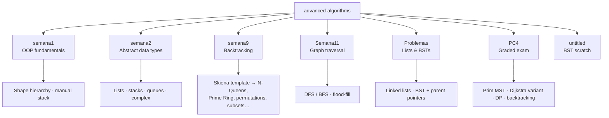

# Advanced Algorithms

**From-scratch implementations of the core algorithm-design paradigms — data structures, graphs, dynamic programming and backtracking — in pure Java.**


---

## Overview

This repository collects roughly 100 Java files (~7,200 lines) written for a university **Advanced Algorithms** course. Rather than leaning on library calls, every data structure and algorithm here is implemented from first principles: interface-backed linked lists, stacks, queues and binary search trees; graph algorithms on flat adjacency arrays; tabulated dynamic programming; and a reusable Skiena-style backtracking framework specialised into a dozen classic problems.

The work is organised chronologically by course week and graded assignment. Each problem is a self-contained class with its own `main()` that parses input from `stdin` in the style of an online judge, making the solutions easy to run and verify in isolation.

> This is genuine, working student coursework — not a polished production library. See [Honest Context](#honest-context) below for a candid assessment.

---

## Features

Grounded strictly in what the code actually implements:

- **Custom abstract data types** behind clean interfaces — singly and doubly linked lists (`IList` / `SList` / `DList`), stacks (`IStack` / `SStack`), queues (`IQueue` / `SQueue`), complex numbers (`iComplex`), and binary search trees with parent pointers (`IBSTree` / `BSTree` / `BSTNode`) supporting insert, search and traversal.
- **Graph algorithms from scratch** on fixed-size adjacency arrays:
  - Prim's Minimum Spanning Tree (*Carreteras*)
  - A maximin / bottleneck-path variant of Dijkstra (*Turista*)
  - Route enumeration across a flight network (*vuelos*)
  - Reusable weighted and unweighted graph classes (`GrafoConPeso` / `GrafoSinPeso`)
- **Dynamic programming** with clean tabulation — longest common subsequence / edit distance, coin change, subset-sum, binomial coefficients, and Fibonacci.
- **Backtracking framework** translated from Skiena's pseudocode (`backtrack` / `is_a_solution` / `construct_candidates` / `process_solution`), specialised into N-Queens (including a **weighted** variant), Prime Ring, permutations, subsets, Lotto, bishops placement, and derangements.
- **Grid flood-fill** via BFS/DFS with 8-directional connectivity for connected-component counting (oil-deposit, battleship).
- **OOP fundamentals** — an encapsulated shape hierarchy (`figura` → `circulo` / `cuadrado` / `triangulo`) and a manual stack.
- **Judge-style I/O** — every solution reads from `stdin` with `Scanner`, suitable for direct online-judge submission.

---

## Architecture

The project is **not** a single shared library. It is seven independent Maven modules — each with its own `pom.xml`, targeting Java 11 under `groupId uni.edu.pe` — grouped by when the material was taught rather than by a common API. This mirrors how the coursework accumulated week over week.



**Key design characteristics**

- **Interface-vs-implementation separation.** ADTs expose a contract (`IList`, `IStack`, `IQueue`, `IBSTree`) that concrete classes implement — a deliberate, reusable-API habit.
- **Flat adjacency arrays.** Graphs use fixed-size arrays (`aristas[v][i]`, `peso[v][i]`, `vecinos[]`) sized by `MAXV` / `MAXvecinos` constants instead of dynamic collections — closer to competitive-programming style and to how the algorithms are reasoned about on paper.
- **Self-contained problems.** Each class owns its `main()` and its input parsing, so any single file can be compiled and run on its own.

---

## Tech Stack

| Area | Technology |
|------|-----------|
| Language | Java 11 |
| Build | Apache Maven (multi-module, one `pom.xml` per module) |
| I/O | `java.util.Scanner` (stdin, judge-style) |
| Paradigms | Data structures, greedy/graph, dynamic programming, backtracking |

---

## Getting Started

### Prerequisites

- **JDK 11+**
- **Apache Maven** (each module ships a Maven wrapper under `.mvn/`)

### Build a module

Each folder is its own Maven project. Build one from inside its directory:

```bash
cd semana9
mvn compile
```

### Run a single solution

Because every problem has its own `main()` and reads from `stdin`, the simplest path is to compile and run the class directly:

```bash
# from a module directory, e.g. PC4
javac -d out src/main/java/**/Carreteras.java
java -cp out Carreteras < input.txt
```

Or run through Maven's exec plugin if configured, pointing at the fully-qualified class name. Input is supplied on standard input in the format each problem expects (see the parsing at the top of each `main`).

> Class names follow the original coursework (some are lowercase, e.g. `coins`, `vuelos`, `reinask`); use the exact name as it appears in the source file.

---

## Project Structure

```
advanced-algorithms/
├── semana1/        # OOP: shape hierarchy (figura/circulo/cuadrado/triangulo), manual stack
├── semana2/        # ADTs: iComplex, IStack/SStack, IQueue/SQueue, IList/SList/DList, text reader
├── semana9/        # Backtracking: Skiena template → N-Queens, Prime Ring, Lotto, subsets,
│                   #   permutations, bishops, derangements, oil-deposit
├── Semana11/       # Graph traversal: adjacency graph, DFS variants, BFS/flood-fill
├── Problemas/      # Linked lists + binary search trees (BSTNode/BSTree/IBSTree)
├── PC4/            # Graded exam: Prim MST (Carreteras), Dijkstra variant (Turista),
│                   #   route enumeration (vuelos), DP (LCS, coins, subset-sum), weighted N-Queens
│                   #   + reusable GrafoConPeso / GrafoSinPeso
├── untitled/       # Scratch module duplicating the BST implementation
└── <module>/
    ├── pom.xml
    └── src/main/java/...
```

---

## Tests

There is **no automated test suite.** Although every module contains the standard `src/test/java` directory, no tests are present. Solutions are validated the way they were built — by feeding judge-style input to each program's `main()` and checking the output against expected results. Adding a JUnit suite is the most obvious next improvement.

---

## Honest Context

In the interest of an accurate picture:

- This is **university coursework**, produced individually for an Advanced Algorithms course — not a team project and not production software.
- **Identifiers and comments are in Spanish.** Naming does not always follow Java conventions (some class names are lowercase, and a few contain typos), reflecting its origin as graded student work.
- There is **copy-paste duplication** across modules — the graph adjacency-array boilerplate and the BST implementation recur near-identically in `PC4`, `Problemas` and `untitled` rather than being shared.
- Data structures rely on **hard-coded fixed-size arrays** (e.g. `MAXV = 100`) instead of dynamic collections or generics.
- A couple of files are scratch or incomplete.

What it *does* demonstrate, honestly: real breadth across the fundamental algorithm-design paradigms, and the ability to implement textbook algorithms — MST, shortest paths, DP tabulation, generic backtracking — correctly and from first principles rather than by calling a library.

---

## Related Portfolio Projects

- [minipython-interpreter](https://github.com/mazk36/minipython-interpreter) — an interpreter for a Python subset
- [os-simulator](https://github.com/mazk36/os-simulator) — an operating-system simulator
- [Pinguino](https://github.com/mazk36/pinguino-monitoring) — a Flask + React monitoring dashboard

---

## Author

**Marcelo Jáuregui** — [github.com/mazk36](https://github.com/mazk36)

Released under the MIT License.
